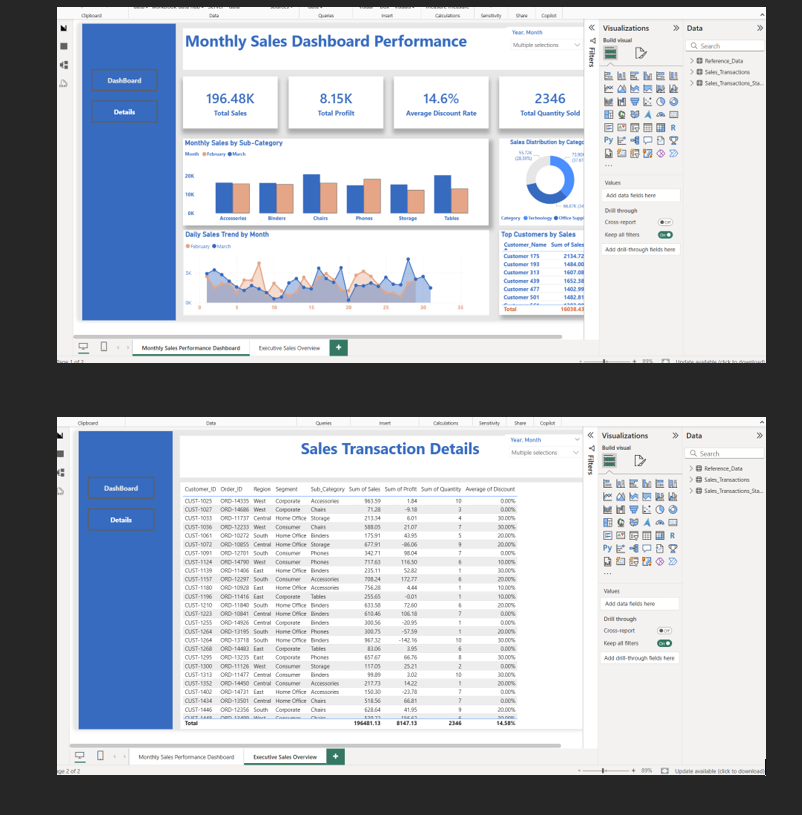

# Monthly Sales Data Analysis & Interactive Dashboard (MS Excel):
## Table of Contents:
- [Objective](#objective)
- [Dashboard](#dashboard)
- [Data Sources](#data-sources)
- [Key KPIs & Business Questions](#key-kpis--business-questions)
- [How to Use](#how-to-use)
- [Technologies Used](#technologies-used)

## Objective:
Developed a comprehensive Monthly Sales Performance dashboard in MS Excel to empower business users to track sales, identify trends, and make informed decisions. The dashboard visualizes monthly sales, highlights best-selling products and top customers, and supports strategic planning for revenue growth and operational efficiency.
## Dashboard:

## Data Sources:
- [ReferenceData.xlsx](https://github.com/hoquesalim/Monthly-Sales-Dashboard/raw/main/ReferenceData.xlsx)
- [Sales_Transactions.xlsx](https://github.com/hoquesalim/Monthly-Sales-Dashboard/raw/main/Sales_Transactions.xlsx)
- [Sales_Transactions_Staging.xlsx](https://github.com/hoquesalim/Monthly-Sales-Dashboard/raw/main/Sales_Transactions_Staging.xlsx)
  
## Key KPIs & Business Questions:
- Total sales revenue for the current month
- Month-over-month sales comparison
- Top-selling products and customers
- Best-performing sales representatives and regions
- Total profit and profit margin
- Sales trend analysis
- Sales target achievement
- Average order value
- Identification of underperforming products/regions

  
## How to Use:
Download the Excel files from the Data Sources section.
Open ReferenceData.xlsx, Sales_Transactions.xlsx, and Sales_Transactions_Staging.xlsx in Microsoft Excel.
Explore the interactive dashboard and use slicers to filter and analyze sales data.

## Technologies Used:
- Power BI used exclusively for creating charts, graphs, and dashboards
- Data Cleaning & Preparation in Excel
